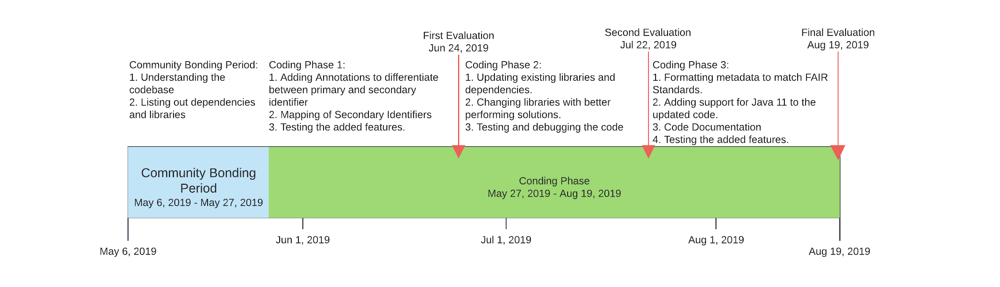

###                                                        Google Summer of Code 2019

##         Personal Background

## Contact:

* **Name:** Manas Awasthi

* **Email:** [marvex17@gmail.com](mailto:marvex17@gmail.com)

* **Contact:** +91-9115050928

* **Github:** [@The-Marvex](https://github.com/The-Marvex)

* **Time Zone:** UTC + 5:30 Hrs

* **CV:** [http://goo.gl/cjj96C](http://goo.gl/cjj96C)

* **LinkedIn:** [https://goo.gl/ZodGd3](https://goo.gl/ZodGd3)


* **Educational Background:** I am currently a 2nd-year student [Cluster Innovation Centre](https://ducic.ac.in/), University of Delhi, New Delhi, India. Pursuing a Bachelor of Technology degree in Information Technology & Mathematical Innovation with a minor in Computational Biology. I will graduate by July 2021. I have been working with Java for over three years and with C++ and Python for two years now. Since the codebase is written entirely in Java, my skills would align perfectly with the task at hand.

   I have been in touch with Bioinformatics as part of my university curriculum since 2nd semester (1st Year) and had biology as a part   of   my curriculum during my school. My interest in Bioinformatics and extensive use of my preferred language pushed me to pursue this   project. I have some experience with open source contribution, but I do have a good understanding of Git and Version Control Services. The   coursework that I have attended includes Object Oriented Programming using Java, Database Management Systems, Natural Language           Processing, Computer System Architecture and C++ Programming. 
  Some of my previous works:
  * Hill Cipher:[Link](https://github.com/The-Marvex/Hill-Cipher)
  * Terminal: [Link](https://github.com/The-Marvex/Terminal)
  * Glaucoma Detection using Deep Learning: [Link](https://github.com/The-Marvex/Glaucoma-Detection-Using-DL)

##       Project Proposal

* **Project Title:** A new BridgeDb major release

* **Project Idea:** [https://github.com/nrnb/GoogleSummerOfCode/issues/132](https://github.com/nrnb/GoogleSummerOfCode/issues/132) 

* **Mentor:** [Egon Willighagen](https://github.com/egonw)

* **Contribution:** Pull Request fixing the issue of the code not compiling with Java 9 and above. Pull Request [#89](https://github.com/bridgedb/BridgeDb/pull/89)** **(Added support of Java 11 to the existing release)

* **Project Overview:** BridgeDb is a platform used for identifier mapping in WikiPathways and PathVisio with support for various languages like as a Cytoscape plugin, as an R package, and an API implemented in OpenRiskNet and OpenPHACTS. BridgeDB provides a platform to link other databases like Ensembl, NCBI Gene, ChEBI, PubChem, etc. The goal of the project is to successfully release a new version of BridgeDb with new functionality and with updated dependencies and libraries. It also requires improvement in the output of metadata to meet the FAIR standards, along with the support of newer Java releases up to Java 11.

* **Project Details:** In Google Summer of 2019, I would work on the following:

* Extension of the existing functionality of BridgeDb.

    * Support for secondary identifiers.

        * Adding an annotation to differentiate primary and secondary identifiers

        * Secondary identifiers to be mapped by BridgeDb to other identifiers.

* Updating / Changing the libraries and dependencies on which BridgeDb works with newer versions or the ones which have better performance.

    * This includes listing out libraries and dependencies along with the alternatives available and comparison of the performance, advantages and disadvantages of one over other.

* Format output of metadata to match FAIR Standards.

* Support for Java 11

* Code Documentation 

# 	     Implementation

* Support for Secondary Classifier:

Changing the schema for Derby SQL and MySQL to add primaryID and secondaryID as two annotations in it.  

The backend uses two kinds of databases:

1. Apache Derby:

For Apache Derby, to add support for secondary identifier a new class SimpleGdbImpl4.java will be created, which will be similar to `SimpleGdbImpl3.java` which currently is working without the secondary identifier support.

2. MySQL:

  For MySQL, `SQLIdMapper.java` will be updated to support the secondary identifiers.

Adding a function to the class Xref:
```java
// Returns whether the entered id is primary or not

public boolean isPrimary(String id)

// Returns primary id associated with the passed id

public String getPrimary(String id)
```
This function shall return true if the id passed is primary and false if not i.e. secondary.

* Updating/Changing the libraries and dependencies with newer versions / better performing solution:

Listing out dependencies during the community bonding period. Finding alternatives and comparing them with currently used dependencies/libraries. 

Replacing the libraries and dependencies which are outdated/have better alternatives available. Making the necessary code base changes to incorporate the same.

* Formatting Metadata to match FAIR Standards:

Creating a function in which the metadata is passed and the necessary changes are made so as to match the FAIR Standards and then returned.
```java
// Returns metadata formatted according to FAIR Standards

public String formatFAIR(String metadata)
```
This function will format the metadata and return formatted metadata which matches all the FAIR Standards and is of the same datatype that of the metadata.

* Adding support for Java 11:

Compiling the committed code with Java 11 and removing any compilation errors that occur.

Removing deprecated dependencies (discontinued from Java 11 and above) and replacing them with supported dependencies.

Test Cases to ensure that all the features of the project are working

* Code Documentation:

I would not only add suitable comments to the code I will be writing but also to the previously written ones. After the implementation of each feature (or task), I will be writing extensive documentation of the same. This documentation would consist of a few use cases and a complete description of the feature available. This would add a good experience for the users as things would look easy.

Different documentation would be written for the new developers who may like to contribute to the project. This would cover the following aspects :

* An overview of the project

* Package level description

* Class level description

* Function level description

* Contribution guidelines

* Testing guidelines

##          

##                Timeline



<table>
  <tr>
    <td>Community Bonding Period</td>
    <td></td>
  </tr>
  <tr>
    <td>May 6 - May 21</td>
    <td>Understanding the current code base</td>
  </tr>
  <tr>
    <td>May 22 - May 27</td>
    <td>Listing out dependencies and libraries and available alternatives and comparison between them.</td>
  </tr>
</table>


<table>
  <tr>
    <td>First Evaluation</td>
    <td></td>
  </tr>
  <tr>
    <td>May 28 - June 9</td>
    <td>Adding annotations to differentiate between primary and secondary identifier.</td>
  </tr>
  <tr>
    <td>June 10 - June 18</td>
    <td>Mapping of secondary identifier</td>
  </tr>
  <tr>
    <td>June 18 - June 24</td>
    <td>Testing and Debugging + Buffer Time</td>
  </tr>
</table>


<table>
  <tr>
    <td>Second Evaluation</td>
    <td></td>
  </tr>
  <tr>
    <td>June 24 - July 3</td>
    <td>Updating existing libraries and dependencies. Removing deprecated libraries and changing them with alternatives.</td>
  </tr>
  <tr>
    <td>July 4 - July 11</td>
    <td>replacing libraries with more performing solutions.</td>
  </tr>
  <tr>
    <td>July 12 - July 22</td>
    <td>Testing and Documentation + Buffer Time</td>
  </tr>
</table>


<table>
  <tr>
    <td>Final Evaluation</td>
    <td></td>
  </tr>
  <tr>
    <td>23 July - Aug 5</td>
    <td>Formatting Metadata to meet FAIR Standards.</td>
  </tr>
  <tr>
    <td>Aug 5 -  Aug 10</td>
    <td>Adding Java 11 support to updated code</td>
  </tr>
  <tr>
    <td>Aug 10 - Aug 14</td>
    <td>Testing and Bug Fixing</td>
  </tr>
  <tr>
    <td>Aug 14 - Aug 19</td>
    <td>Code Documentation + Release of new version + Buffer Time </td>
  </tr>
</table>


* I do not foresee any difficulty in the execution of my proposal. In case I would feel that I am unable to pass some barrier, I would resolve it through discussion with mentors and thorough online research.

## Availability:

* Classes will be dispersed on 29th April.

* Semester Exam will commence from 10th May and will continue till 26th May. I will not be able to work on the project. I will make up for this lost time by working for extra hours regularly over the course of the project.

* I do not have any school-related activities scheduled for summers / the coding period.

* I do not any full-time or part-time internships planned for this summer.

* I will be working on the project for around 35-40 hours a week, distributed evenly through the week.

* I will be located in Kanpur, Uttar Pradesh, India. I will be travelling to my hometown. I will be travelling for a night, which will not intervene with my working hours. 

